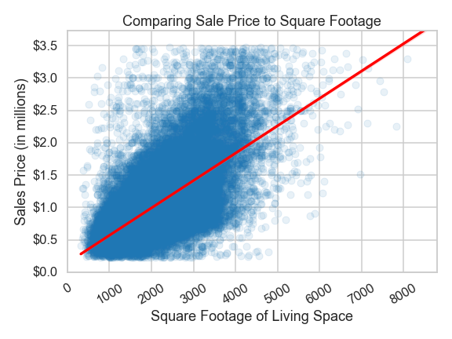

# Housing Project
***

**Author:** Ron Lodetti Jr.


## Overview
***
This project analyzes housing data from [King County Assessor Data](https://info.kingcounty.gov/assessor/DataDownload/default.aspx) to help a startup create an app to find and recommend housing deals. Statistical analysis of this data shows that **square footage** of living space, whether or not the property is on a **waterfront**, and its **zip code** are the best predictors of sale price. Further data collection and analysis should be done to develop a more reliable model.

## Business Understanding
***
A new startup is developing an app to help consumers find the best deals on home purchases. The company would like to beta test in King County, Washington before expanding into other markets. My task is to analyze the housing data to find what features of a property best determine the sale price. The company will use this information to recommend properties to customers which are priced below the model's price.

## Data Understanding
*** 
For this project I used the dataset provided by the Flatiron School which comes from [King County Assessor Data](https://info.kingcounty.gov/assessor/DataDownload/default.aspx) 


I merged the original dataset with three other data sets from [King County Assessor Data](https://info.kingcounty.gov/assessor/DataDownload/default.aspx):

- Residential Building
- Parcel
- Real Property Sales

As well as a dataset from [OpenDataSoft](https://data.opendatasoft.com/) to gather information about King County zip codes.

Once merged, it consisted of 47,579 property sales, each containing information on 19 unique variables. 


## Modeling
***
Since I only have a sample of the data, that is, the price of homes that have sold and not the price of all of the homes in King County, WA, I have decided to statistical analysis. This will allow me to make inferences based the sample data I have. 

### Initial Feature Selection
To begin deciding what features to include in my model, I looked at how each variable correlated with `price` and chose `sqft_living`, `grade`, `bathrooms`, `bedrooms`, `view`, `sqft_basement`, `waterfront` and `greenbelt`. I also decided to include `zipcode`, to account for changes in price based on location of the property.


I then created a heatmap to check for multicollinerity between the predictors and removed `grade` as it was highly correlated with `sqft_living` and had a slightly lower correlation with `price`. 

### Baseline Model
Since `sqft_living` is the feature with the strongest correlation, I will use this for my baseline model.<br> 
**Target Variable:** price <br> 
**Predictor Variable:** sqft_living



#### Baseline Interpretation Model
The baseline model is statistically significant and explains about 42% of the variance in price. In a typical prediction, the model is off by about $305k.

The intercept is at about $145,700. This means that a house with the zero square footage of living space in the home would sell for \$145,700.

The coefficient for `sqft_living` is about $423. This means for each increase of 1 square foot of living space in the home, we see an associated increase of about \$423.

### Recursive Feature Elimination
To begin my model iteration, I included all of the relevant features. Then I removed one feature at a time starting with any feature with a p-value larger than 0.01. Then I removed the feature with the smallest absolute coefficient as that means it has the least effect of `price`. I used the adjusted R-squared value, Mean Absolute Error, and Conditional Number to judge the model and help me decide when to stop removing features. I have also normalized each numeric feature to make it easier to compare their coefficients. 

Here is a table which includes the records the metrics for each iteration as well as what changed between each iteration. 

**Target Variable:** price <br> 
**Predictor Variables:**
- sqft_living_norm 
- bathrooms_norm
- bedrooms_norm 
- view_norm
- sqft_basement_norm
- greenbelt
- waterfront
- zipcode


### Final Model
I decided to have my final model be the step where `greenbelt` was dropped (index = 8) because the the Adjusted R-Squared was high, the Mean Absolute Error was relatively low, and the Conditional Number didn't seem to improve much as the iteration continued. 

**Target Variable:** price <br>
**Predictor Variables:** sqft_living_norm, waterfront, and 65 different zip codes.

 

## Regression Results
***
The final model is statistically significant and explains about 72% of the variance in price, a large improvement over the original 42%. The Mean Absolute Error has also improved from $305k to \$197k.

The intercept is at about $865,700. This represents the predicted price of a property with the average square footage of living space, not on a waterfront, and in a King County zip code not included in our model. 

The coefficient for `sqft_living_norm` is about $292,100. This means for each increase of 1 standard deviation of square foot of living space in the home, we see an associated increase of about \$292,100. Since the standard deviation of `sqft_living` is about 836, for every increase of 1 square foot of living space, we can expect and increase of about \$349 in sale price. 

The coefficient for `waterfront` is about $480,200, which means we can expect a home on a waterfront to have an increase in sales price of \$480,200. 

Since we have 65 `zipcode` features, it would be more helpful describe their overall shape than to go one by one. Each `zipcode` coefficient represents the predicted change in sale price for properties located within that zip code.

All of the coefficients are statistically significant.

### Model Evaluation
Next I checked our assumptions when using linear regression and found that:

- There is likely not a linear relationship between the variables and
- the residuals are not completely distributed normally.

Since our model fails at two of the assumptions underlying linear regression, we cannot be  be confident in it's results, despite the high R-squared value. 

## Conclusion
***
Based on our final model, the three features which best determine sale price are:
* **sqft_living** - Square footage of living space in the home
* **waterfront** - Whether the house is on a waterfront
* **zipcode** - The 5-digit zip code assigned by the U.S. Postal Service. Only includes zip codes in King County, WA.

I would advise the startup to gather these three pieces of data for houses currently on the market in King County, WA and recommend houses where the sale price is below what our model would determine.  

### Limitations
There does not appear to be a linear relationship between our predictor and target variables. The residuals of our final model are also not normally distributed. Failing these two assumptions for linear regression should cast doubt as to the results of the model. This indicates that there are likely other factors that affect price which are not included in the model.

Despite including more data than the original dataset, we are still limited by our dataset, which doesn't include other factors in determining price, such as the federal interest rate at the time of the sale, housing availability, and other qualities of the neighborhood where each property is located. 

### Next Steps
Based on this project's limitations, I would recommend we:
- gather more data to include other factors that determine sale price and
- create new models with include interaction variables to account for the potential non-linear relationship between variables

## For More Information

See the full analysis in the [Jupyter Notebook](./housing_project.ipynb) or review this [presentation](./housing_project_presentation.pdf).

For additional info, contact Ron Lodetti at [ron.lodetti@gmail.com](mailto:ron.lodetti@gmail.com)

## Repository Structure

```
├── code
│   ├── __init__.py
│   ├── data_modeling.py
│   ├── data_prep.py
│   └── data_visuals.py
├── data
├── images
├── README.md
├── requirements.txt
├── housing_project_presentation.pdf
└── housing_project.ipynb


```
